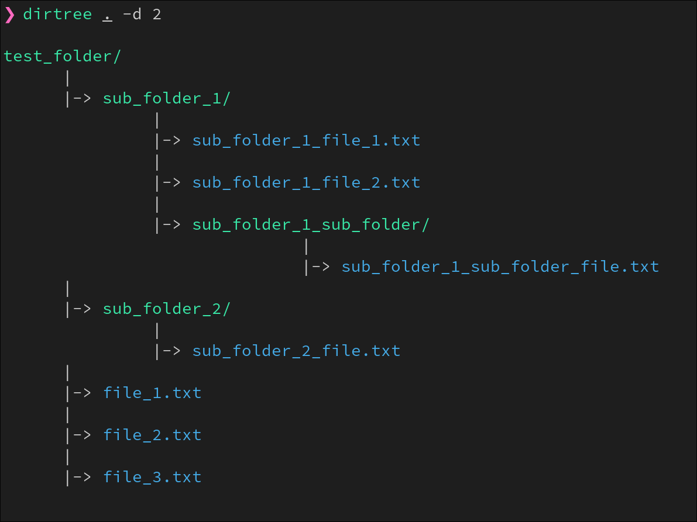

## Dirtree

I simple cli tool to visualize the files in a directory. It was primarily built for linux but i have added preprocessor macros for portability to windows. If you find any bugs feel free to raise an issue.

## How to use

The first argument is taked as the path. The optional flags include - 
- `-d` It used to set the depth level of the search performed during the tree construction. Only takes the values from 0 to 9. Default is 1.
- `-i` It used to specify the folders you dont want to see the contents of. Useful when you dont want to dependecy folders like node_modules. Can take many args.
- `-p` It used to set the path. By default the first arg is path but if you change the order using the flags then you have to specify the path using -p or it will take its as pwd.

